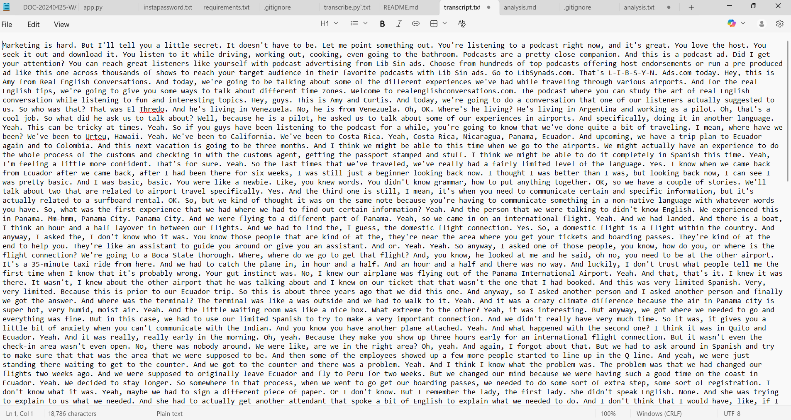
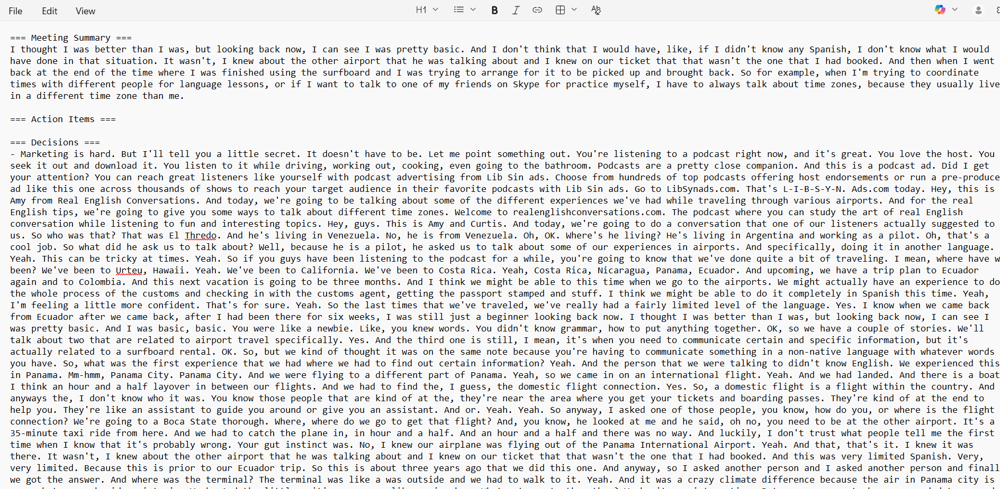

# AI Meeting Intelligence

Automate transcription and analysis of meeting audio using AI.  
Generates a transcript and a summarized Markdown report for easy reading and sharing.

---

## Features

- Transcribe meeting audio (`.mp3`) to text using OpenAI Whisper
- Summarize transcripts into key topics and action items
- Generate Markdown reports
- Easy-to-follow CLI workflow

---
## Demo

**Input audio:** `ai meeting.mp3`

### Example Transcript


### Example Analysis


## Setup

### 1. Clone the repository
```bash
git clone https://github.com/05804/AI_Meeting_Intelligence.git
cd AI_Meeting_Intelligence
